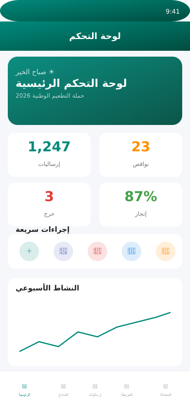
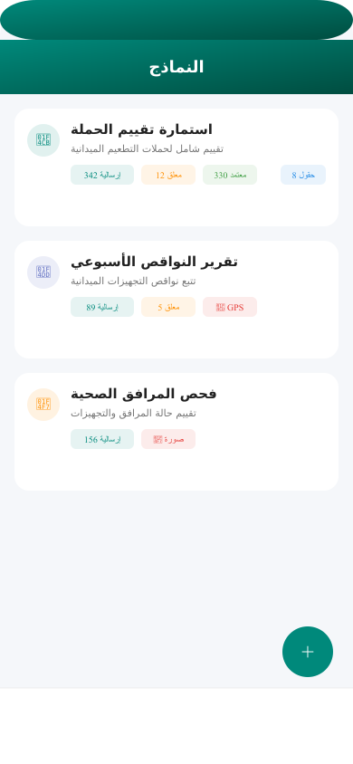
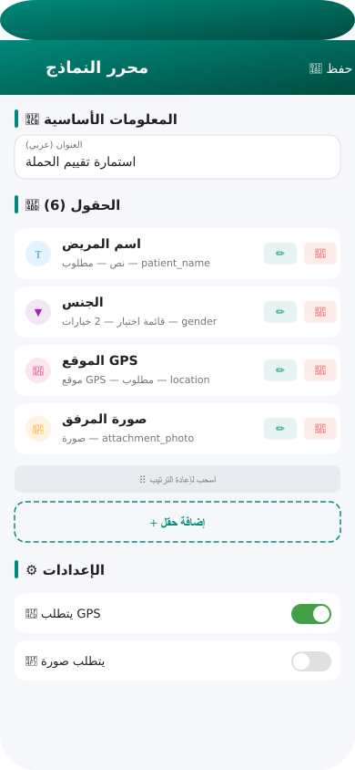
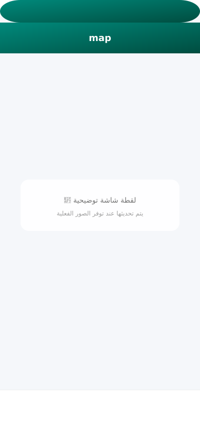
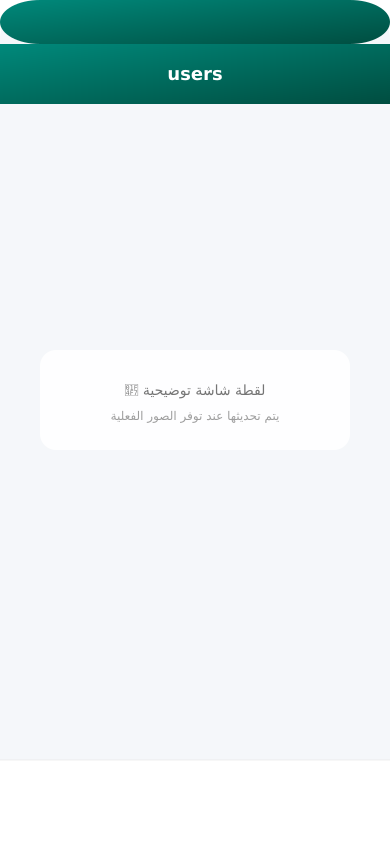
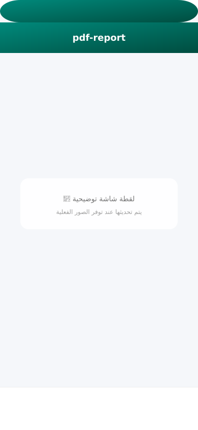
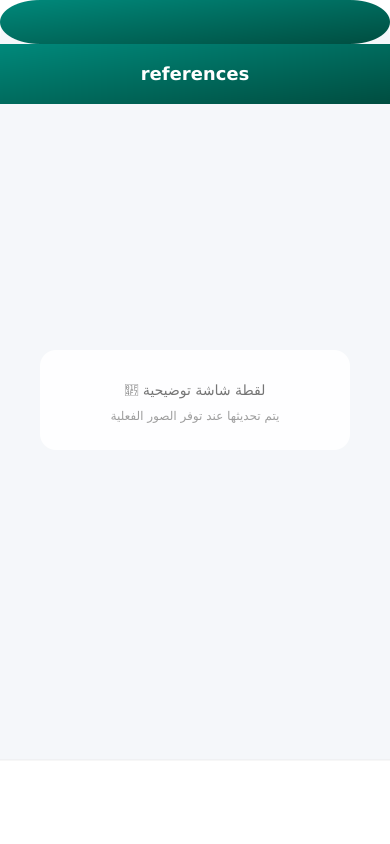

<div align="center">


# 🏥 منصة مشرف EPI

### نظام إشراف ميداني متكامل لحملات التطعيم
*Field Supervision System for Immunization Campaigns*


[📱 تحميل APK](https://github.com/mohammedshoqi123-art/EPI-Supervisor/releases) · [🌐 لوحة الإدارة](https://mohammedshoqi123-art.github.io/EPI-Supervisor/) · [📖 دليل المستخدم](docs/user-guide/) · [🐛 الإبلاغ عن مشكلة](https://github.com/mohammedshoqi123-art/EPI-Supervisor/issues)

</div>

---

## 📋 نظرة عامة

**منصة مشرف EPI** هي نظام SaaS متكامل لإدارة والإشراف على حملات التطعيم الميدانية في اليمن. تهدف إلى تحسين كفاءة الإشراف الميداني وتوفير بيانات دقيقة للقرارات الصحية.

### لماذا مشرف EPI؟

<table>
<tr>
<td width="50%">

**التحديات الحالية:**
- 📝 تعبئة استمارات ورقية بطيئة
- 📡 فقدان بيانات في المناطق المنعزلة
- 📊 تقارير متأخرة وغير دقيقة
- 🔍 صعوبة تتبع النواقص الميدانية

</td>
<td width="50%">

**الحلول:**
- ✅ نماذج إلكترونية ذكية
- ✅ عمل بدون إنترنت + مزامنة تلقائية
- ✅ لوحات تحليلات فورية
- ✅ خرائط تفاعلية + GPS

</td>
</tr>
</table>

---

## 📸 لقطات الشاشة

<div align="center">

### 🏠 لوحة التحكم الرئيسية


مؤشرات KPI حية — رسوم بيانية — إجراءات سريعة — تصدير PDF

---

<table>
<tr>
<td align="center" width="200">
<br/>
<b>📝 النماذج الذكية</b><br/>
<sub>نماذج ديناميكية — GPS — صور<br/>حفظ محلي — مزامنة تلقائية</sub>
</td>
<td align="center" width="200">
<br/>
<b>🔧 محرر النماذج</b><br/>
<sub>10 أنواع حقول — أقسام<br/>سحب وإفلات — ترتيب</sub>
</td>
<td align="center" width="200">
<br/>
<b>🗺️ الخرائط التفاعلية</b><br/>
<sub>OpenStreetMap — clustering<br/>عرض الإرساليات GPS</sub>
</td>
</tr>
<tr>
<td align="center" width="200">
<br/>
<b>📋 حالة الإرساليات</b><br/>
<sub>موافقة / رفض — فلترة<br/>חיפוש — تفاصيل</sub>
</td>
<td align="center" width="200">
<br/>
<b>👥 إدارة المستخدمين</b><br/>
<sub>5 أدوار — بحث — تفعيل<br/>محافظات ومديريات</sub>
</td>
<td align="center" width="200">
<br/>
<b>🤖 المساعد الذكي</b><br/>
<sub>MiMo AI — تحليل بالعربي<br/>رؤى وتوصيات</sub>
</td>
</tr>
<tr>
<td align="center" width="200">
<br/>
<b>💬 المحادثة الداخلية</b><br/>
<sub>تواصل بين المستخدمين<br/>إشعارات فورية</sub>
</td>
<td align="center" width="200">
<br/>
<b>📄 تقارير PDF</b><br/>
<sub>5 أنواع تقارير<br/>تصميم احترافي عربي</sub>
</td>
<td align="center" width="200">
<br/>
<b>📚 إدارة المراجع</b><br/>
<sub>إخفاء/إظهار — تصنيف<br/>بحث — ملفات مرفقة</sub>
</td>
</tr>
</table>

> 📷 **ملاحظة:** الصور التوضيحية أعلاه هي أماكن مخصصة. يتم تحديثها عند توفر لقطات الشاشة الفعلية.

</div>

---

## ✨ المميزات الرئيسية

### 🔐 نظام الصلاحيات الهرمي (RBAC)
| الدور | المستوى | الوصف |
|-------|---------|-------|
| 🔴 مدير النظام | 5 | وصول كامل — إدارة كل شيء |
| 🟣 مركزي | 4 | رؤية كل البيانات + إدارة النماذج |
| 🔵 محافظة | 3 | رؤية بيانات محافظته + الموافقة/الرفض |
| 🟢 مديرية | 2 | رؤية بيانات مديريته + التصدير |
| ⚪ إدخال بيانات | 1 | إرسال النماذج + رؤية بياناته فقط |

### 📝 نماذج ديناميكية — محرر متكامل
- **10 أنواع حقول:** نص، رقم، جوال، نص طويل، اختيار، اختيار متعدد، نعم/لا، تاريخ، GPS، صورة
- **محرر أقسام:** تقسيم النموذج إلى أقسام بعناوين فرعية
- **سحب وإفلات:** إعادة ترتيب الحقول بسهولة
- **إعدادات متقدمة:** GPS إلزامي، صورة إلزامية، عدد صور أقصى
- **تحديث عبر السيرفر:** بدون تحديث التطبيق

### 📡 Offline First — أهم ميزة
```
الحفظ المحلي أولاً → طابور المزامنة → إعادة المحاولة التلقائية → حل التعارضات
```
- **Always-Save-First**: البيانات تُحفظ في Hive أولاً دائماً
- **Priority Queue**: إرساليات التطعيم (critical) تُرسل أولاً
- **Exponential Backoff**: 10s → 30s → 90s → 5min → 15min
- **Dead-Letter Queue**: العناصر الفاشلة تنتقل لمراجعة يدوية
- **Smart Merge**: حل التعارضات بـ 4 استراتيجيات ذكية
- **Auto-Sync**: كل 5 دقائق + عند استعادة الاتصال

### 📄 تقارير PDF احترافية
- 📅 تقرير الإرساليات اليومي
- 📆 تقرير الإرساليات الأسبوعي
- ⚠️ تقرير النواقص والاحتياجات
- 🗺️ تقرير أداء المحافظات
- 📋 التقرير الشامل (كل البيانات)
- غلاف مُصمم بAsStringAsync + جداول ملونة + رؤوس وذيول مُmarca

### 🗺️ خرائط تفاعلية
- OpenStreetMap مع clustering للنقاط
- Heatmap للإرساليات
- عرض المواقع GPS للإرساليات
- تحديد المناطق على الخريطة

### 📊 تحليلات ولوحة تحكم
- مؤشرات KPI حية (إرساليات، نواقص، إنجاز)
- رسوم بيانية: دائري، خطي، أعمدة
- تقارير PDF قابلة للاستخراج
- فلترة حسب المحافظة/المديرية/الفترة

### 🤖 مساعد ذكي (MiMo AI)
- تحليل البيانات باللغة العربية
- رؤى وتوصيات ذكية
- إجابة على أسئلة حول بيانات الحملة
- تنبؤات النواقص

---

## 🏗️ البنية المعمارية

```
EPI-Supervisor/
├── apps/
│   ├── mobile/                          📱 تطبيق Flutter (Android + Web PWA)
│   │   ├── lib/
│   │   │   ├── main.dart                نقطة الدخول
│   │   │   ├── router/                  التوجيه (go_router)
│   │   │   ├── providers/               الحالة (Riverpod)
│   │   │   └── screens/                 الشاشات (~20 شاشة)
│   │   └── test/                        الاختبارات
│   └── admin-web/                       🌐 لوحة إدارة الويب (React + Vite)
│       └── src/
│           ├── pages/                   صفحات الإدارة (~15 صفحة)
│           └── components/              مكونات UI
├── packages/
│   ├── core/                            🧠 منطق العمل الأساسي
│   │   └── lib/src/
│   │       ├── auth/                    المصادقة وإدارة الجلسات
│   │       ├── api/                     عميل API الموحد
│   │       ├── offline/                 نظام Offline-First
│   │       ├── security/                التشفير و RBAC
│   │       ├── ai/                      خدمات الذكاء الاصطناعي
│   │       ├── reports/                 مولدات PDF احترافية
│   │       └── database/                خدمات قاعدة البيانات
│   ├── shared/                          🎨 مكونات UI، Theme، Models
│   └── features/                        ⚡ وحدات الميزات المتقدمة
├── supabase/
│   ├── functions/                       ⚡ 14 Edge Function (Deno/TS)
│   │   ├── _shared/                     وظائف مشتركة (Auth, CORS)
│   │   ├── submit-form/                 إرسال النماذج
│   │   ├── sync-offline/               مزامنة البيانات
│   │   ├── ai-chat/                     محادثة AI
│   │   ├── get-analytics/              الإحصائيات
│   │   ├── get-advanced-reports/        التقارير المتقدمة + PDF
│   │   ├── admin-actions/              إدارة المستخدمين
│   │   └── ... (14 إجمالاً)
│   └── migrations/                      هيكل قاعدة البيانات
│       ├── 001_schema.sql               الجداول + RLS + المشغلات
│       ├── 002_seed_data.sql            22 محافظة + أحياء + مرافق صحية
│       └── 20260416_*.sql               التحديثات التراكمية
├── scripts/                             🔧 سكريبتات البناء والنشر
├── docs/                                📚 التوثيق
├── melos.yaml                           📦 إدارة Monorepo
└── .github/workflows/ci.yml             🔄 CI/CD Pipeline
```

---

## 🚀 البدء السريع

### المتطلبات

| الأداة | الإصدار | ملاحظة |
|--------|---------|--------|
| Flutter SDK | 3.27+ | [flutter.dev](https://flutter.dev) |
| Dart SDK | 3.6+ | مرفق مع Flutter |
| Supabase CLI | أحدث | `npm install -g supabase` |
| حساب Supabase | — | مجاني حتى 50,000 مستخدم |

### 1️⃣ استنساخ المشروع

```bash
git clone https://github.com/mohammedshoqi123-art/EPI-Supervisor.git
cd EPI-Supervisor
```

### 2️⃣ إعداد Supabase

```bash
# تسجيل الدخول
supabase login

# ربط المشروع
supabase link --project-ref YOUR_PROJECT_REF

# تطبيق هيكل قاعدة البيانات + البيانات الأولية
supabase db push

# نشر Edge Functions
supabase functions deploy
```

### 3️⃣ إعداد متغيرات البيئة

```bash
cp .env.example .env
nano .env  # عدّل القيم
```

**متغيرات Supabase Edge Functions** (في Supabase Dashboard → Edge Functions → Secrets):
```
SUPABASE_URL=https://your-project.supabase.co
SUPABASE_ANON_KEY=your-anon-key
SUPABASE_SERVICE_ROLE_KEY=your-service-role-key
MIMO_API_KEY=your-mimo-api-key
ALLOWED_ORIGINS=https://your-domain.com,http://localhost:5173
ENCRYPTION_KEY=your-32-char-minimum-secure-key
```

### 4️⃣ تشغيل التطبيق

```bash
cd apps/mobile
flutter pub get

# تشغيل على Android
flutter run --dart-define=SUPABASE_URL="https://..." \
  --dart-define=SUPABASE_ANON_KEY="..." \
  --dart-define=ENCRYPTION_KEY="your-key"

# تشغيل على الويب
flutter run -d chrome --dart-define=SUPABASE_URL="..." \
  --dart-define=SUPABASE_ANON_KEY="..." \
  --dart-define=ENCRYPTION_KEY="your-key"
```

### 5️⃣ بناء APK

```bash
flutter build apk --release \
  --dart-define=SUPABASE_URL="https://..." \
  --dart-define=SUPABASE_ANON_KEY="..." \
  --dart-define=ENCRYPTION_KEY="your-key"
```

---

## 🗄️ قاعدة البيانات

| الجدول | الوصف | السجلات الافتراضية |
|--------|-------|-------------------|
| `profiles` | المستخدمون + الأدوار + المحافظة | — (إنشاء تلقائي) |
| `governorates` | المحافظات اليمنية | 22 محافظة |
| `districts` | المديريات | ~120 مديرية |
| `health_facilities` | المرافق الصحية | ~50 مرفق |
| `forms` | تعريفات النماذج + Schema | — (من لوحة الإدارة) |
| `form_submissions` | الإرساليات + GPS + صور | — |
| `supply_shortages` | نواقص التجهيزات | — |
| `audit_logs` | سجل تدقيق | تلقائي |
| `notifications` | الإشعارات | تلقائي |
| `doc_references` | المراجع والوثائق | — |
| `app_settings` | إعدادات النظام | 11 إعداد افتراضي |

---

## 🔒 الأمان

| الطبقة | التقنية | التفاصيل |
|--------|---------|----------|
| 🔐 التشفير المحلي | AES-256-GCM | PBKDF2 (100K iterations) |
| 🛡️ قاعدة البيانات | Row Level Security | كل الجداول محمية |
| 🔑 المصادقة | JWT (Supabase Auth) | بدون fallback غير آمن |
| ⏱️ Rate Limiting | Edge Functions | 10 طلبات/دقيقة (fail-closed) |
| 🌐 CORS | Allowlist | مُقيد بنطاق محدد |
| 📋 Audit Logs | تلقائي | جميع العمليات مسجلة |
| 🗑️ Soft Delete | كل الجداول | حذف آمن قابل للاستعادة |

---

## 📦 التقنيات المستخدمة

**الواجهة الأمامية:**
| التقنية | الاستخدام |
|---------|-----------|
| Flutter 3.27 | إطار العمل الرئيسي |
| flutter_riverpod | إدارة الحالة |
| go_router | التوجيه |
| flutter_map + latlong2 | الخرائط |
| fl_chart | الرسوم البيانية |
| hive_flutter | التخزين المحلي |
| supabase_flutter | الاتصال بالخادم |
| pdf + printing | تقارير PDF |
| share_plus | مشاركة الملفات |

**الخلفية:**
| التقنية | الاستخدام |
|---------|-----------|
| Supabase | PostgreSQL + Auth + Realtime |
| Edge Functions | Deno/TypeScript |
| PostGIS | دعم جغرافي |
| Row Level Security | أمان قاعدة البيانات |

**لوحة الويب:**
| التقنية | الاستخدام |
|---------|-----------|
| React 18 | إطار العمل |
| Vite | البناء السريع |
| Tailwind CSS | التصميم |
| Recharts | الرسوم البيانية |

---

## 🔄 CI/CD Pipeline

```
push to main
    ↓
┌─────────────┐
│ Analyze     │ → flutter analyze --no-fatal-infos
│ & Test      │ → flutter test --coverage
└──────┬──────┘
       ↓
┌─────────────┐
│ Build APK   │ → flutter build apk --release
└──────┬──────┘
       ↓
┌─────────────┐
│ Deploy      │ → Supabase Functions + GitHub Pages
│ & Release   │ → Automatic release with APK
└─────────────┘
```

---

## 📚 التوثيق

| الملف | الوصف |
|-------|-------|
| [SETUP_GUIDE.md](SETUP_GUIDE.md) | دليل الإعداد التفصيلي |
| [docs/sync_system_v2.md](docs/sync_system_v2.md) | توثيق نظام المزامنة |
| [docs/epi-knowledge-base.md](docs/epi-knowledge-base.md) | قاعدة معرفة التطعيم |
| [docs/user-guide/](docs/user-guide/) | دليل المستخدم (PDF + DOCX) |
| [AUDIT_REPORT.md](AUDIT_REPORT.md) | تقرير الفحص الشامل |

---

## 🤝 المساهمة

هذا مشروع مملوك (Proprietary). المساهمات من فريق التطوير الداخلي فقط.

1. إنشاء فرع من `develop`
2. تنفيذ التغييرات + اختبارات
3. Pull Request إلى `develop`
4. مراجعة + دمج إلى `main`

---

## 📄 الترخيص

**Proprietary** — جميع الحقوق محفوظة. يُمنع النسخ أو التوزيع بدون إذن كتابي.

---

<div align="center">

**Built with ❤️ for Yemen's Healthcare**

منصة مشرف EPI v2.2.0

</div>
